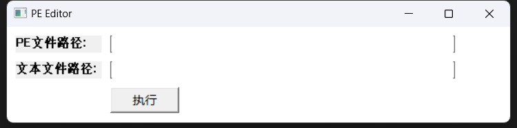
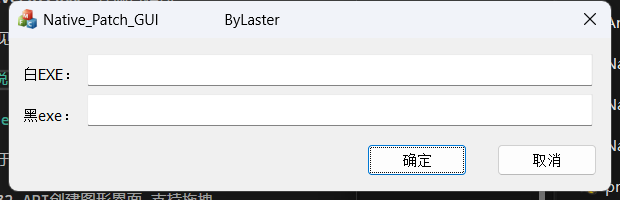
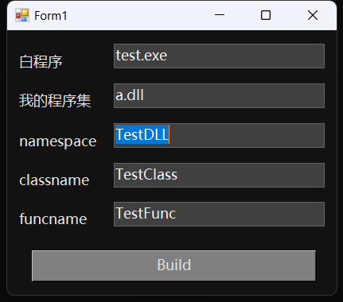

# 项目介绍

## 项目概述

此项目包含多个不同的子项目，旨在演示如何对Native程序和Dotnet程序进行白patch。通过对这些程序进行patch，可以学习和掌握在不同环境下修改程序行为的方法。项目包括以下组件：

1. **NativePatch_GUI**: 一个基于Win32 API的GUI程序示例。
2. **NativePatch_MFC**: 一个基于MFC框架的GUI程序示例。
3. **DotnetPatch**: 针对Dotnet程序集的patch示例。
4. **a**: 测试程序集。
5. **test**: 被patch的Dotnet测试程序。
6. **NativePatch**：控制台程序

参考样本请见：[52pojie示例](https://www.52pojie.cn/thread-1900852-1-1.html)。

## 子项目说明

### NativePatch_GUI
+ 
这是一个基于Win32 API的GUI程序。该示例展示了如何通过插入shellcode或其他方式修改程序的行为。主要特点包括：

- 使用Win32 API创建图形界面,支持拖拽。
- 展示如何在程序的不同部分插入自定义代码。
- 提供详细的注释和文档，便于学习和理解。

### NativePatch_MFC
+ 
这是一个基于MFC框架的GUI程序，MFC框架提供了丰富的GUI组件，适合开发复杂的桌面应用程序。主要特点包括：

- 使用MFC框架创建图形界面。
- 演示如何通过修改代码实现程序行为的改变。
- 提供详细的注释和文档，便于学习和理解。

### DotnetPatch
+ 
此子项目展示了如何对Dotnet程序集进行patch。通过修改IL代码或插入shellcode，可以改变程序集的行为。主要特点包括：

- 使用IL修改技术对Dotnet程序集进行patch。
- 演示如何插入和执行自定义代码。
- 提供详细的注释和文档，便于学习和理解。

## 开发模板与建议

### Shellcode

+ **开发模板**: [CppDevShellcode](https://github.com/clownfive/CppDevShellcode)
  - 提供了一个开发shellcode的基础模板，便于快速开始。
  - 包含示例代码和详细的使用说明。
+ **建议**: 远程加载Cobalt Strike的shellcode以减少体积。
  - 通过远程加载可以减少本地文件的体积，提高加载效率。
  - 提供示例代码演示如何实现远程加载。

### 白文件(待patch文件)

+ 尽量选择体积较大的文件。
  - 体积较大的文件通常有更多的空间进行修改和插入代码。
+ 尽量选择子系统不为控制台的文件(避免黑框)。或修改PE标识符。
  - GUI程序更适合进行展示和交互，避免控制台黑框影响体验。

## 程序自动化patch

该项目旨在实现程序的完全自动化patch，确保patch过程简单高效。主要特点包括：

- 自动化patch脚本：提供了一键式的patch脚本，简化操作流程。
- 详细的文档和注释：每个步骤都有详细的说明，便于理解和操作。
- 可扩展性：支持对不同类型的程序进行patch，具有较高的灵活性。

## 结语

通过本项目的学习和实践，可以掌握在不同环境下进行程序patch的基本技巧和方法。希望这些示例和文档能够帮助到您，如果有任何问题或建议，欢迎提出。

# 免责协议

本项目仅供学习和研究目的使用。使用者应当遵守所在国家和地区的相关法律法规，禁止将本项目用于任何非法用途。项目开发者不对使用者的行为及其后果承担任何责任。

1. **法律责任**: 使用者在使用本项目的过程中，应自行确保其行为符合法律规定。任何因使用本项目而导致的法律问题，均由使用者自行承担责任。

2. **风险承担**: 使用本项目可能涉及修改和执行程序代码，这些操作存在风险，包括但不限于程序崩溃、系统不稳定等。使用者应自行承担所有使用过程中产生的风险。

3. **无担保声明**: 本项目以“现状”形式提供，不包含任何明示或暗示的担保。项目开发者不对因使用本项目而产生的任何直接或间接损害承担责任，包括但不限于数据丢失、业务中断等。

4. **第三方链接**: 本项目中可能包含第三方网站或资源的链接。这些链接仅为方便使用者提供，项目开发者不对第三方网站或资源的内容、准确性或使用承担责任。

5. **责任限制**: 在法律允许的最大范围内，项目开发者不承担任何由于使用或无法使用本项目而引起的直接、间接、特殊或附带损害。

通过使用本项目，您同意接受上述免责条款。如果您不同意这些条款，请不要使用本项目。
